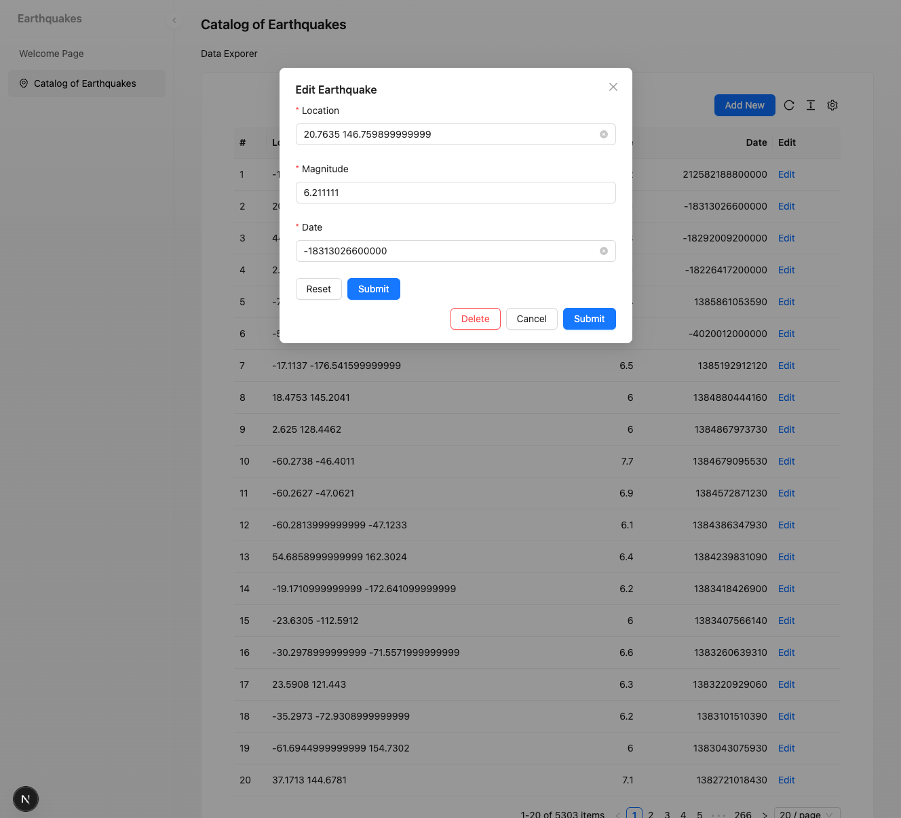

# Earthquakes Application

## Overview

This is a **monorepo application** with:

- **Backend**: Node.js + TypeScript + GraphQL.
- **Frontend**: React + Next.js.
- **Package Manager**: **pnpm**.



---

## Prerequisites

Ensure the following tools are installed before proceeding:

- **Node.js**: `20.16.0` (specified in `.nvmrc` file).
- **pnpm**: Latest version (`npm install -g pnpm`).
- **Docker** (for containerized environments).

---

## Setup Instructions

### 1. Clone the Repository

```bash
git clone git@github.com:anatolyshipitsyn/earthquakes.git && cd earthquakes
```

### 2. Install Dependencies

Install the required dependencies for all applications using `pnpm`:

```bash
pnpm install
```

### 3. Set Up Environment Variables

Environment variables must be configured for each application. Copy the provided `.env.example` files and populate them:

```bash
cp apps/backend/.env.example apps/backend/.env
cp apps/frontend/.env.example apps/frontend/.env
```

**Note**: Populate placeholders in the `.env` files with environment-specific values (e.g., database credentials, API
keys).

---

## Running the Application

There are two ways to start the application:

### Option A: Using Docker

Launch the application in a fully containerized environment:

```bash
docker compose up --build -d
```


### Option B: Manual Start

#### 1. Start Database and Redis
Make sure the required services (database and Redis) are running locally.

Alternatively, you can start them using Docker:
```bash
docker-compose up db redis
```

#### 2. Start the Backend (GraphQL API)
Set up environment variables and run the following commands:

```bash
nvm use
pnpm --filter=backend run dev
```

#### Start the Frontend

Set up environment variables and run the following commands:

```bash
nvm use
nvm use && pnpm --filter=frontend run dev
```

The application will be available at: **http://localhost:3000**

---

## Database Setup

### Apply Migrations

```bash
pnpm run migrate
```

### Generate New Migrations

```bash
pnpm generate-migration src/database/migrations/NewMigrationName
```

---

## Code Quality & Formatting

### Linting
To check for linting issues:
```sh
pnpm lint
```

To automatically fix linting issues:
```sh
pnpm lint:fix
```

### Prettier Formatting
To format code:
```sh
pnpm prettier --write .
```

---

## Building & Production

### Build the Application

```sh
pnpm build
```

### Start in Production

```sh
pnpm start
```

---

## Testing
(Currently no tests are configured.)

---

## Contribution Guidelines
- Follow ESLint and Prettier rules.
- Use feature branches and submit PRs.
- Run `pnpm lint` before committing.

---

This document provides a structured way to get started with the application. Let me know if you need further customization! 🚀
